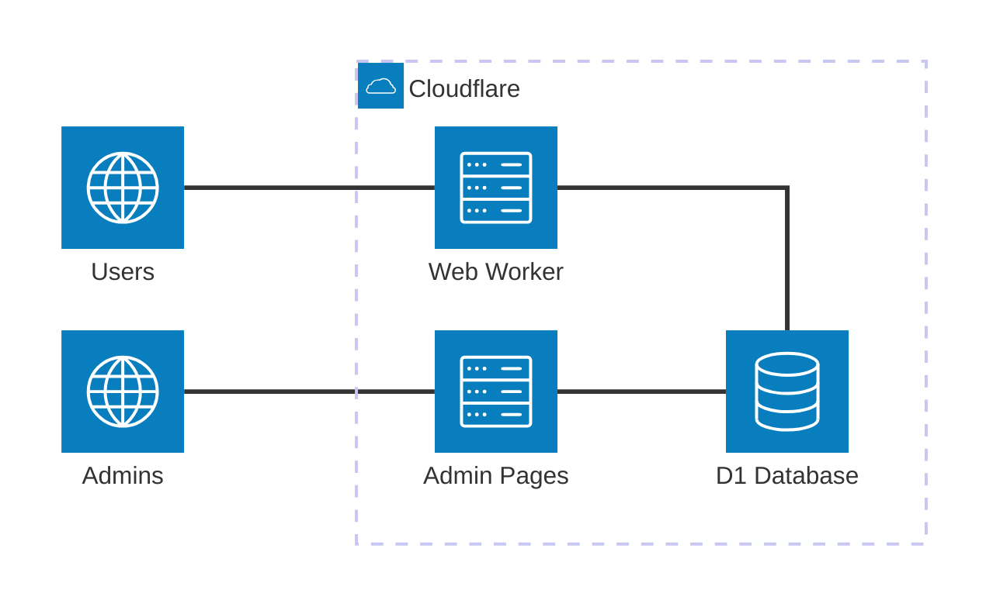

# aka

aka is a lightweight personal URL shortener.

It runs on [Cloudflare Workers](https://workers.cloudflare.com/)
with a [SvelteKit](https://svelte.dev/docs/kit/introduction#What-is-SvelteKit) admin interface.

## Structure

The main site runs on [Cloudflare Workers](https://www.cloudflare.com/en-gb/developer-platform/products/workers/)
and redirects users to links based on the path they are accessing.

Links are stored in a [Cloudflare D1 database](https://www.cloudflare.com/en-gb/developer-platform/products/d1/).

The admin site runs on [Cloudflare Workers](https://www.cloudflare.com/en-gb/developer-platform/products/workers/)
and uses [SvelteKit](https://svelte.dev/docs/kit/introduction#What-is-SvelteKit).



## Local development

### First-time setup

```bash
# tba
# - init db with schema
```

### Running web

```bash
# tba
```

### Running admin

```bash
# tba
```
